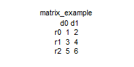
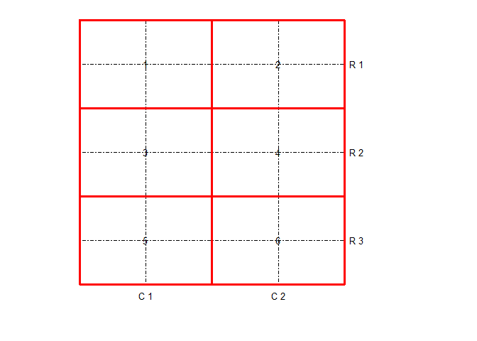
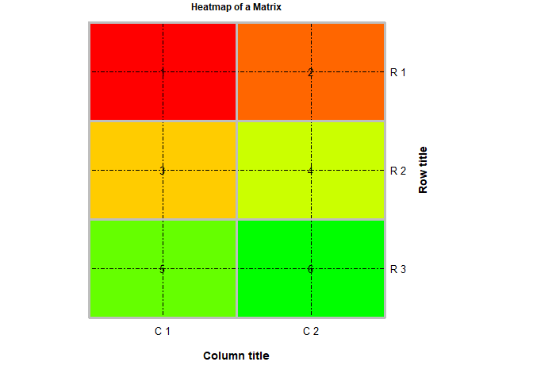
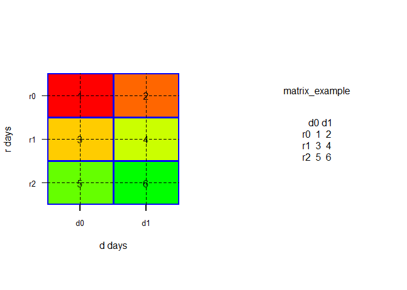
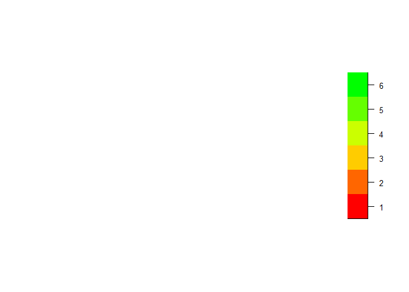
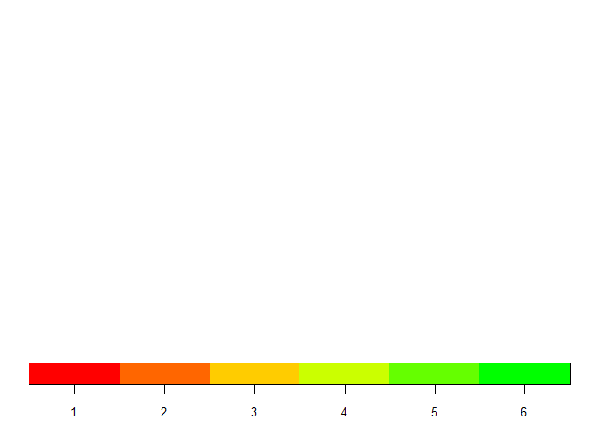
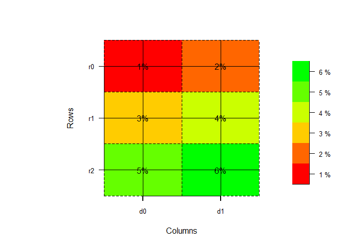

## Goal
Plot a heatmap of a random matrix of $n \times m$ elements and decorate it with grids lines, texts and personalized axis

## Matrix generation

```r
set.seed(1023)
nc <- 2
nr <- 3
matrix_example <- matrix(1:(nr * nc), nr, nc, byrow = TRUE)
matrix_example
```

```
##      [,1] [,2]
## [1,]    1    2
## [2,]    3    4
## [3,]    5    6
```

## Set names

```r
row_names <- paste0("r", 0:(nr - 1))
col_names <- paste0("d", 0:(nc - 1))
colnames(matrix_example) <- col_names
rownames(matrix_example) <- row_names
matrix_example
```

```
##    d0 d1
## r0  1  2
## r1  3  4
## r2  5  6
```

## Color scale

```r
my_palette <- colorRampPalette(c("red", "yellow", "green"))(n = 6)
color_breaks <- c(
    seq(1, 2, length = 2),  # for red
    seq(3, 4, length = 2), # for yellow
    seq(5, 6, length = 2)) # for green
```

## Using heatmap function
To start playing with heatmap, set Rowv and Colw to NA to avoid showing the dendogram. In addition, I recommend to set `revC = TRUE` to get a heatmap that mimics the matrix configuration from top to bottom (1 to n) and form left to right (1 to m). Also chose scale = 'none' to have the image of actual values in the matrix.


```r
op <- par(cex.main = 0.6, font.main = 1)
heatmap(matrix_example, Rowv = NA, Colv = NA, revC = TRUE 
    , scale = "none"
    , cexRow = 1, cexCol = 1
    , col = my_palette
    , xlab = "d days"
    , ylab = "r days"
    , main = "Heatmap of a Matrix"
)
```

<!-- -->

```r
par(op)
```

## Matrix as a plot

```r
op <- par(no.readonly = TRUE, cex = 0.7, mar = rep(0, 4))
plot(1,1, typ = 'n', axes = FALSE, xlab = '', ylab = '', xlim = c(0, nc), ylim = c(0, nr))
matrix_text <- paste(capture.output(print(matrix_example)), collapse = "\n")
text(nc / 2, nr - 0.5, "matrix_example")
text(nc / 2, nr - 0.8, matrix_text, adj = c(0.5, 1))
```

<!-- -->

```r
par(op)
```


## Each cell grid line

In order to decorate heatmap function result with new elements like grids or texts, run teh heatmap function with verbose option = TRUE


```r
par(cex.main = 0.6) #reduced size of the main title

layout_dimensions <- capture.output(
    heatmap(matrix_example, Rowv = NA, Colv = NA, revC = TRUE
    , labCol = rep("", nc) # to control the type of column labels
    , labRow = rep("", nr) # to control the type of row labels
    , scale = "none"
    , cexRow = 0.8, cexCol = 0.8
    , col = my_palette
    , main = "Heatmap of a Matrix" #In case you want a main title
    , verbose = TRUE)
)
```

<!-- -->


```r
layout_dimensions
```

```
## [1] "layout: widths =  0.05 4 , heights =  0.25 4 ; lmat="
## [2] "     [,1] [,2]"                                      
## [3] "[1,]    0    3"                                      
## [4] "[2,]    2    1"
```

With the layout info heigth, width and mat, you can build a new layout on top of heatmap that takes care of axis, labels, grids and texts


```r
par(cex.main = 0.6)

lmat <- matrix(c(4, 2, 3, 1), 2, 2, byrow = TRUE) 
lhei <- c(0.25, 4)
lwid <- c(0.05, 4)
#new layout
layout(lmat, widths = lwid, heights = lhei, respect = TRUE)
#limits
xlim <- 0.5 + c(0, nc)
ylim <- 0.5 + c(0, nr)

# default margin for heatmap. Change it if it was change in heatmap parameters
par(mar = c(5, 0, 0, 5), xaxs = 'i', yaxs = 'i')

plot(1, 1, type = 'n', xaxt = 'n', yaxt = 'n', ann = FALSE,
    xlim = xlim, ylim = ylim)
# axis ticks and labels
axis(1, 1L:nc, las = 1, labels = paste("C", 1L:nc), line = -0.5, tick = 0)
axis(4, nr:1L, las = 2, labels = paste("R", 1L:nr), line = -0.5, tick = 0)
# GRID through the cell centers
abline(h = 1:nr, v = 1:nc, lty = 4)
# GRID through cell boundaries
abline(h = (1:(nr - 1)) + 0.5, v = (1:(nc - 1)) + 0.5, col = "red", lwd = 3)
# heatmap box
box("plot", col = "red", lwd = 3)
# Text in the center of each cell
for (i in 1:nc) {
  for (j in 1:nr) {
      text(i , j, sprintf("%.0f", t(matrix_example[nrow(matrix_example):1, ])[i, j]),
           col = "black", cex = 1)
  }
}
```

<!-- -->


```r
par(cex.main = 0.6)
heatmap(matrix_example, Rowv = NA, Colv = NA, revC = TRUE
    , labCol = rep("", 2)
    , labRow = rep("", 3)
    , scale = "none"
    , cexRow = 0.8, cexCol = 0.8
    , col = my_palette
    , main = "Heatmap of a Matrix"
)

# It is key that 4th is in the same matrix position than 1 in heatmap layout
lmat <- matrix(c(1, 2, 3, 4), 2, 2, byrow = TRUE) 
lhei <- c(0.25, 4)
lwid <- c(0.05, 4)
#new layout
layout(lmat, widths = lwid, heights = lhei, respect = TRUE)
#limits
xlim <- 0.5 + c(0, nc)
ylim <- 0.5 + c(0, nr)

# default margin for heatmap. Change it if it was change in heatmap parameters
# new parameter in required to add next decorations on top of the heatmap
par(mar = c(5, 0, 0, 5), new = TRUE, xaxs = 'i', yaxs = 'i')
plot(1, 1, type = 'n', xaxt = 'n', yaxt = 'n', ann = FALSE,
    xlim = xlim, ylim = ylim)
# axis ticks and labels
axis(1, 1L:nc, las = 1, labels = paste("C", 1L:nc), line = -0.5, tick = 0)
axis(4, nr:1L, las = 2, labels = paste("R", 1L:nr), line = -0.5, tick = 0)
# column lab
mtext("Column title", cex = 0.9, font = 2, line = 2.5, side = 1)
# rows lab
mtext("Row title", cex = 0.9, font = 2, line = 2.5, side = 4)
# GRID through the cell centers
abline(h = 1:nr, v = 1:nc, lty = 4)
# GRID through cell boundaries
abline(h = (1:(nr - 1)) + 0.5, v = (1:(nc - 1)) + 0.5, col = "gray", lwd = 3)
# heatmap box
box("plot", col = "gray", lwd = 3)
# Text in the center of each cell
for (i in 1:nc) {
  for (j in 1:nr) {
      text(i , j, sprintf("%.0f", t(matrix_example[nrow(matrix_example):1, ])[i, j]),
           col = "black", cex = 1)
  }
}
```

<!-- -->


## Element (1,1) at top left corner

Another possibility is to use directly the image function and create your own heatmap


```r
par(mfrow = c(1, 2))
op <- par(no.readonly = TRUE)
par(pty = 's')
image(1:nc, 1:nr
    , t(matrix_example[nrow(matrix_example):1, ])
    , axes = FALSE
    , xlab = "d days"
    , ylab = "r days"
    , col = my_palette
    , bty = "l")

axis(side = 1, at = 1:nc, labels = col_names, las = 1, cex.axis = 0.8, 
     lwd.ticks = 2, tick = TRUE, line = 0)
axis(side = 2, at = 1:nr, labels = rev(row_names), las = 1, cex.axis = 0.8)

abline(h = (0:nr) + 0.5, v = (0:nc) + 0.5, col = "blue", lwd = 3)
abline(h = (1:nr) , v = 1:nc, lty = 2)
for (i in 1:nc) {
  for (j in 1:nr) {
      text(i , j, sprintf("%.0f", t(matrix_example[nrow(matrix_example):1, ])[i, j]),
           col = "black", cex = 1)
  }
}

# Plot of matrix values
plot(1,1, typ = 'n', axes = FALSE, xlab = '', ylab = '', xlim = c(0, 2), ylim = c(0, 2))
matrix_text <- paste(capture.output(print(matrix_example)), collapse = "\n")
text(1, 1.8, "matrix_example")
text(1, 1, matrix_text)
```

<!-- -->

```r
par(op)
```

## Vertical legend

```r
op <- par(no.readonly = TRUE)
par(mai = c(0, 0, 0.42, 0.42))
par(plt = c(0.85, 0.9, 0.25, 0.75))
m_legend <- seq(range(matrix_example)[1], range(matrix_example)[2], length.out = 6)
dim(m_legend) <- c(1, 6)
image(1, 1:6
    , t(m_legend[nrow(m_legend):1, ])
    , xlab =  "", ylab = ""
    , xaxt = 'n', yaxt = 'n'
    , col = my_palette
    , bty = "o"
)

axis(side = 4, at = 1:6, labels = as.vector(m_legend),
    las = 1, cex.axis = 0.8, tick = TRUE)
```

<!-- -->

## Horizontal legend

```r
op <- par(no.readonly = TRUE)
par(mai = c(0.42, 0, 0, 0))
par(plt = c(0.05, 0.95, 0.1, 0.15))
m_legend <- seq(range(matrix_example)[1], range(matrix_example)[2])
m_legend <- rep(m_legend, 2)
m_legend <- matrix(m_legend, 2, 6, byrow = TRUE)
image(1:6, 1:2
    , t(m_legend[nrow(m_legend):1, ])
    , xlab =  "", ylab = ""
    , xaxt = 'n', yaxt = 'n'
    , col = my_palette
    , bty = "o"
)

axis(side = 1, at = 1:6, 
    labels = as.vector(m_legend[1, 1:6]), las = 1, cex.axis = 0.8, tick = TRUE)
```

<!-- -->


## Same image including 0

```r
op <- par(no.readonly = TRUE)
par(pty = 's')
image(0:nc, 0:nr
    , t(matrix_example[nrow(matrix_example):1, ])
    , axes = FALSE
    , xlab = "Columns"
    , ylab = "Rows"
    , col = my_palette)
abline(h = (0:nr) + 0.5, v = (0:nc) + 0.5)
abline(h = (0:nr) , v = 0:nc, lty = 2)

axis(side = 1, at = (1:nc) - 0.5, labels = col_names
    , las = 1, cex.axis = 0.8, lwd.ticks = 2
    , tick = TRUE, line = 0)
axis(side = 2, at = (1:nr) - 0.5, labels = rev(row_names),
    las = 1, cex.axis = 0.8)

for (i in 1:nc) {
  for (j in 1:nr) {
    text(i - 0.5 , j - 0.5,
        sprintf("%.0f%%", t(matrix_example[nrow(matrix_example):1, ])[i, j]),
        col = "black", cex = 1)
    }
}

par(op)
par(mai = c(0, 0, 0.42, 0.42))
par(plt = c(0.85, 0.9, 0.25, 0.75))
par(new = TRUE)
m_legend <- seq(range(matrix_example)[1], range(matrix_example)[2], length.out = 6)
dim(m_legend) <- c(1, 6)
image(1, 1:6
    , t(m_legend[nrow(m_legend):1, ])
    , xlab =  "", ylab = ""
    , xaxt = 'n', yaxt = 'n'
    , col = my_palette
    , bty = "o"
)

axis(side = 4, at = 1:6, labels = paste(as.vector(m_legend), "%"),
    las = 1, cex.axis = 0.8, tick = TRUE)
```

<!-- -->

## Next steps

1. More color palettes
2. Use heatmap option to scale and center matrix values along row direction (scale = "row") or vertical direction (scale = "column")
3. Use ColSideColors and RowSideColors to generate side bars with values.
4. Explore dendogram use
